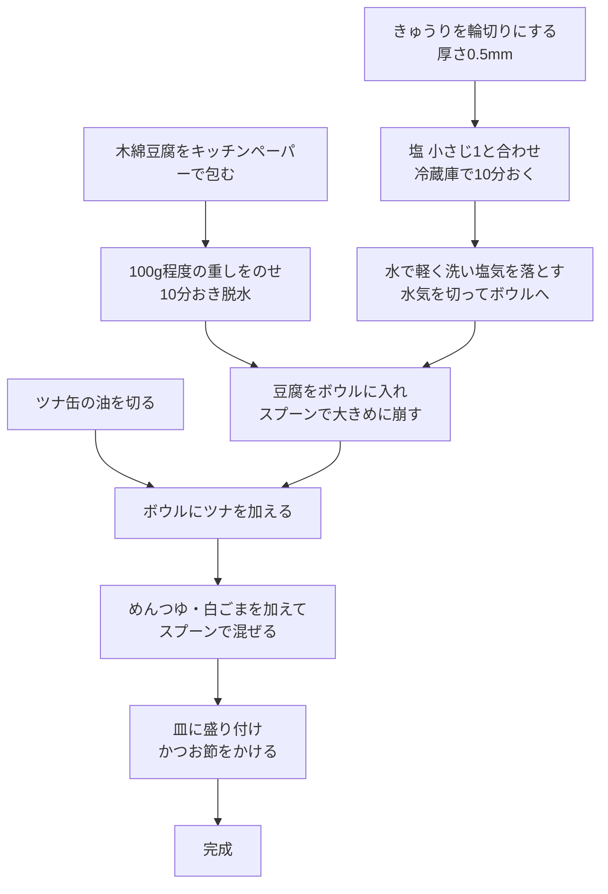

# ツナ・きゅうり・豆腐のサラダ

## 材料（2人前）

- きゅうり: 1/2 本
- 木綿豆腐: 100g
- ツナ缶: 90g
- めんつゆ(2倍濃縮): 大さじ1
- 白ごま: 適量
- かつお節: 適量
- 塩: 小さじ1

## 作り方

1. きゅうり 1/2 本は、厚さ0.5mm程度の輪切りにし、塩 小さじ1と合わせて冷蔵庫で10分おく
2. 木綿豆腐は水気を切ってキッチンペーパーで包み、100g程度の重しを置いて10分おき、脱水する
3. 1のきゅうりは軽く水で洗って塩気を落とし、水気を切ってボウルに入れる
4. 2の木綿豆腐水気を切って3のボウルに入れる。スプーンなどで大きめに崩す
5. ツナ缶は油を切って4のボウルに入れる
6. 5のボウルにめんつゆ、白ごまを入れ、スプーンで混ぜる
7. 皿に盛り付け、かつお節をかける
8. 完成

## 手順フロー

## メモ
- ツナ缶は[オーシャンプリンセス 綿実油ソリッド](https://oceanprincess.jp/products/ops-12g)を使いました
- めんつゆは[ヤマキ めんつゆ](https://www.yamaki.co.jp/catalog/products/index.php?id=56)を使いました
- 白ごまはすりごまを併用するとより美味しくいただけます